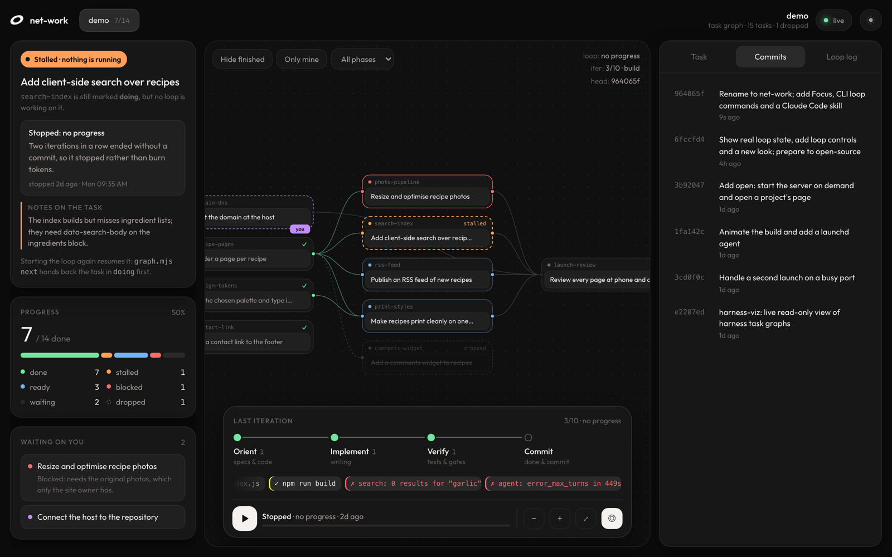
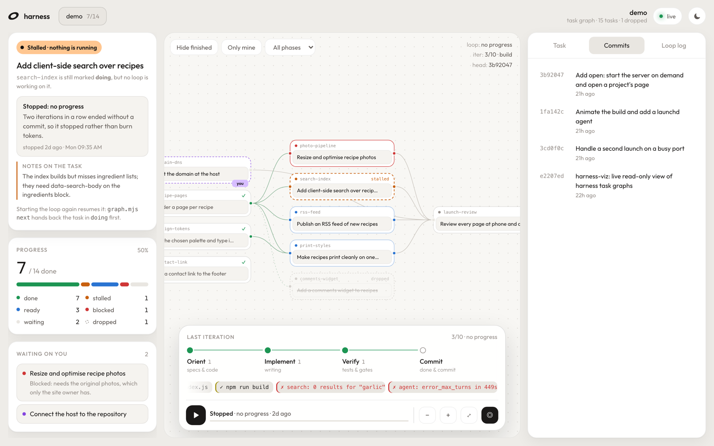

# net-werk

**A net that werks.** Plan a project as a net of small, verifiable tasks, let an agent loop
build it one task at a time, and watch the net work: the task graph as it moves
(ready → doing → done), what the current iteration is doing right now, and — when the loop
stops — **why** it stopped. It comes with the harness kit to scaffold a project, and a Claude
Code skill that takes you from "let's do a harness" to a running loop.



It's built for the "harness" pattern: `specs/` that say what's true, a task graph of small
verifiable tasks in `harness/graph/`, and a loop script that runs one fresh
[Claude Code](https://docs.anthropic.com/en/docs/claude-code) `claude -p` per task (the
[Ralph](https://github.com/ghuntley/how-to-ralph-wiggum) technique, plus a graph and gates).

Zero dependencies: Node's `http` module, server-sent events and one static page.

## How it works

**Nothing moves into net-werk.** The harness lives in your project: `specs/` (what you're
building), `harness/graph/` (one file per task) and `harness/bin/loop.sh` (the loop). net-werk
is a window onto those files — it reads them live and draws them — and ▶ simply runs your
project's own `loop.sh`, as if you'd typed `./harness/bin/loop.sh build 10` in a terminal.

**One iteration is one task.** Each iteration is a fresh Claude Code session that takes the next
ready task, does only that, proves it with the project's gates, and commits it. You choose how
many iterations to allow when you press ▶ (default 10) — a budget, not a target. The loop stops
sooner by itself when every task is done, when only your tasks are left, after two iterations in
a row without a commit, or when the graph has an error.

**It adapts in two specific ways.**

- *While building:* work the agent finds that belongs to another task goes into the graph as a
  new task, not done on the spot. A task it can't finish — it needs a credential, an asset or a
  decision — is marked **blocked** with a one-line note saying what's missing.
- *When the specs change:* if `specs/` changed since the last plan, the next run **re-plans**
  first — tasks the new direction makes pointless are dropped, new ones added, the rest
  updated. The specs steer, not the agent: to change direction, edit the specs.

**It finishes what it can, then waits on you.** Tasks owned by a human (accounts, credentials,
money, taste) are gates the loop never passes. When only those are left, it stops and says
**Waiting on you**; everything that depends on them waits too. Do yours, mark them done, and
press ▶ again.

## Install

```bash
git clone https://github.com/Julius-PC/net-werk.git
cd net-werk
npm link                          # puts `net-werk` on your PATH; there is nothing to install
net-werk open examples/demo       # try it
```

Requires Node 20+. Tested on macOS; Linux should work (loop detection uses `ps` and `lsof`).
Without `npm link`, use `node bin/net-werk.mjs` wherever this README says `net-werk`.

`examples/demo` is a made-up recipe-site project whose loop stopped after two iterations
without progress. Its `loop.sh` is a **simulation** — it prints the same log format as a real
loop but never calls Claude — so ▶ and ■ are safe to try.

## The Claude Code skill

`skills/net-werk/SKILL.md` gives Claude Code the whole flow. Download it into your skills folder:

```bash
mkdir -p ~/.claude/skills/net-werk
curl -fsSL https://raw.githubusercontent.com/Julius-PC/net-werk/main/skills/net-werk/SKILL.md \
  -o ~/.claude/skills/net-werk/SKILL.md
```

Then, in a Claude Code session on your project, say you want a harness — "let's do a harness
for this", or `/net-werk`. The order never changes:

1. **Plan.** Claude enters plan mode, reads the repo, asks what the project is for and what must
   never happen, and writes the plan: the specs, every task with its dependencies and
   acceptance, the rules, the gates, and how many iterations to run.
2. **Approve.** You read the plan and approve it (or ask for changes). Nothing is written before
   this.
3. **Scaffold.** `net-werk init` lays down the machinery; Claude writes the specs, tasks, rules
   and gates from the plan, validates, and commits it as `plan: scaffold the harness`.
4. **Open.** The dashboard opens on the project.
5. **Run.** The loop starts (default `build` × 10) and you watch it build.

On a project that already has a harness, the skill skips to step 4, and starts the loop when
you asked it to run. It won't start a second loop, a loop on a broken graph, or one with no
agent work ready.

## The harness kit

`kit/harness/` is a complete, dependency-free harness that `net-werk init <path>` copies into a
project (it never overwrites existing files):

| File | Job |
| --- | --- |
| `bin/graph.mjs` | the task graph: `validate` (schema + DAG), `next` (the one task to do now), `status`, `set <id> <status>` |
| `bin/loop.sh` | the loop: one fresh `claude -p` per task; re-plans first when `specs/` changed; stops when all done, when only human tasks are left, or after two iterations without a commit |
| `bin/stream.mjs` | turns Claude Code's stream-json into one log line per tool call, so the loop can be watched live |
| `bin/verify.mjs` | the gates every task must pass — add your tests, build and checks |
| `schema/task.schema.json` | what a task file may contain |
| `prompts/build.md`, `plan.md` | what one iteration does, and how the graph is re-derived from the specs |

The specs, the tasks, and each project's rules and gates are the plan's to write.

## Use it on your projects

```bash
net-werk                                  # serve on http://127.0.0.1:4545
net-werk open ~/src/app                   # start the server if needed, open that project
net-werk init ~/src/app                   # copy the harness kit into a project
net-werk info ~/src/app                   # plain-text state: progress, doing, loop, why it stopped
net-werk start ~/src/app --mode build --iterations 10
net-werk stop ~/src/app
net-werk add ~/src/app                    # register a project (list | remove work too)
```

Any subfolder of `~/code` that contains `harness/graph/` shows up as a tab on its own. Point
discovery elsewhere with `NET_WERK_DISCOVER=~/src:~/work` (a `:`-separated list).

### What a project needs

| Path | What net-werk reads |
| --- | --- |
| `harness/graph/<id>.md` | One task per file: YAML frontmatter + a markdown brief. Required: `id`, `title`, `status` (`todo` · `doing` · `done` · `blocked` · `dropped`), `owner` (`agent` · `human`). Optional: `phase`, `priority`, `depends_on`, `acceptance`, `verify`, `spec`, `notes`. |
| `harness/.loop.log` | The loop's output (gitignore it). Tailed live. |
| `harness/bin/loop.sh` | Optional. If present, ▶ runs `loop.sh <mode> <iterations>`. |
| `harness/prompts/<mode>.md` | Optional. Each file is a mode ▶ offers (`build`, `plan`, …). |

The frontmatter parser is a small YAML subset: scalars, inline arrays (`[a, b]`) and dash lists.

Status meanings: `doing` is a lock held by the task being worked on. `blocked` needs a
`notes:` saying why. `dropped` means superseded by a change of direction — terminal but not
done, so it's left out of "x / y done". `owner: human` marks gates the loop can't pass
(credentials, taste, DNS); they're dashed purple with a "you" tag.

### The loop log

net-werk understands these lines (all optional; anything else is shown as-is):

```text
════ 2026-09-28 09:14:02 ════          a run starts
── loop: mode=build max=10 ──
── iteration 3/10 ─────────             an iteration starts
── specs changed since the last plan — re-planning before building ──
### NEXT TASK — 3 ready                 the iteration's task brief (or ### RESUME …)
09:27:37  ▸ read specs/site.md          a tool call: ▸ read|edit|write|grep|$ <command>|subagent …
09:27:36  » Resuming from the notes.    something the agent said
09:33:31  ✗ build failed                an error
09:35:02  agent finished: success in 449s, 120 turns
```

A "re-planning before building" line with no task brief after it yet shows the loop as
**Re-planning**, and the task left in `doing` as on hold.

These are the ways a run can end, which become the "why it stopped" text:

| Line | Shown as |
| --- | --- |
| `── reached iteration cap ──` | Hit its iteration cap |
| `every task is done — stopping.` | All done |
| `nothing left for the agent — stopping.` | Waiting on you (only human tasks are ready) |
| `two iterations without progress — stopping …` | Stopped: no progress |
| `graph is unhappy (exit N)` | Stopped: graph is invalid |
| `the re-plan left the graph invalid — stopping.` | Stopped: re-plan broke the graph |
| `── stopped from net-werk ──` | Stopped by you (written when you press ■) |
| *(none, and no process)* | Interrupted — killed, Ctrl-C, or a closed terminal |

The kit's `loop.sh` already writes all of these. If you bring your own loop, pipe Claude Code's
stream-json through [`kit/harness/bin/stream.mjs`](kit/harness/bin/stream.mjs) to get one line
per tool call:

```bash
exec > >(tee -a harness/.loop.log) 2>&1     # everything the loop prints also lands in the log
claude -p "$(cat "$PROMPT")" --output-format stream-json --verbose | node harness/bin/stream.mjs
```

## What you see

| Area | Shows |
| --- | --- |
| Loop card | **Building** (a loop is running and a task is in `doing`), **Re-planning**, **Running · between tasks**, **Stalled** (a task is in `doing` but nothing is running — with the reason and the task's notes), or **Idle** |
| Progress | done / doing / ready / blocked / waiting, with dropped counted separately |
| Waiting on you | ready human tasks, and blocked tasks with their notes |
| Graph | the DAG left to right by dependency depth. Opens zoomed on the active task. Click a task for its brief, acceptance, verify, spec and notes |
| Dock | Orient → Implement → Verify → Commit for the current iteration, inferred from its tool calls, and a lane of those calls |
| Controls | ▶ opens a popover to pick the mode and number of iterations; ■ stops a running loop after a confirm. Zoom, fit (⤢) and **Focus** (◎) |
| Inspector | the selected task, recent commits (`task(<id>): …` commits link to their task), and the raw loop log |

In the graph: **green ✓** done · **yellow, glowing** being built now · **blue** ready ·
**grey** waiting on earlier tasks · **dashed purple with a "you" tag** yours · **red** blocked ·
**dashed orange** stalled · **struck through** dropped.

**What's actually done?** A green task passed its gates and was committed — click it to see
the commit; every `task(<id>): …` line under Commits is one finished task. From a terminal,
`net-werk info <path>` prints the same summary.

### Running it, day to day

1. **Plan** — "let's do a harness" with the skill: plan mode, you approve, it scaffolds and
   starts the loop. (Or scaffold by hand with `net-werk init` and press ▶.)
2. **Watch, or walk away.** It stops by itself.
3. **Read the loop card and act on the reason:**
   - *Waiting on you* — do your tasks, mark them done, ▶.
   - *Hit its iteration cap* — ▶ to keep going.
   - *Stalled* or *No progress* — read the task's notes; usually a spec is unclear. Fix it, ▶.
   - *All done* — it's built.
4. **Change direction** — edit `specs/` and commit; the next run re-plans before building.

net-werk doesn't edit tasks, so mark your own tasks done from the project — tell Claude in the
project's chat, or:

```bash
node harness/bin/graph.mjs set <task-id> done
```

"Stalled" means something narrow: a task is still marked `doing`, but no loop is running (it hit
its cap or was killed mid-task). Pressing ▶ resumes that task first.

**Focus** keeps the camera on the task being built and follows the loop as it moves on.
Switching it on glides to the active task; moving the graph yourself — drag, scroll, pinch,
zoom or fit — switches it off.

**Is a loop actually running?** A task file saying `doing` only means an iteration took the
lock; if the loop then hit its cap or was killed, nothing releases it. So net-werk looks for the
process: a `loop.sh` (or `claude -p`) whose working directory is the project root. It doesn't go
by the log's modification time — a long build can leave the log quiet for minutes while the
loop is fine, and a loop killed seconds ago still has a fresh log.

**Motion.** Current flows along the edges into the task being built, tool calls float up off
its node, a finished task bursts green and newly unlocked tasks glow. All of it is off under
`prefers-reduced-motion`.

Light and dark themes follow the system; the header toggle overrides it.

## Security

The page shows private plans and can start processes, so:

- The server binds **127.0.0.1 only**, and rejects requests whose `Host` isn't
  `127.0.0.1:<port>` or `localhost:<port>` (DNS-rebinding protection).
- Start/stop are `POST`s that must carry an `X-Net-Werk` header and a same-origin `Origin`.
  A web page on another site can't send that header without a CORS preflight, which the server
  never approves.
- Starting runs only the project's own `harness/bin/loop.sh`, with a mode that must match a file
  in `harness/prompts/` and an iteration count from 1 to 200.
- Stopping sends SIGTERM (then SIGKILL) to that project's loop and everything it started, and
  appends one line to its `.loop.log`. Nothing else in a project is ever written.
- `serve --read-only` turns the controls off entirely.

A loop started from the page keeps running if the server stops. Whatever `loop.sh` grants the
agent (for example `--permission-mode acceptEdits`) is the real trust decision; net-werk just
presses the button.

## Configuration

| | |
| --- | --- |
| `--port 4600` | port for `serve`, `open`, `start`, `stop`, `install` (default 4545) |
| `--read-only` | no start/stop controls |
| `NET_WERK_DISCOVER` | folders to scan for projects (default `~/code`) |
| `NET_WERK_CONFIG` | where the registry lives (default `~/.config/net-werk`) |

net-werk used to be called harness-viz (and briefly net-work): `bin/harness-viz.mjs`,
`~/.config/harness-viz` and the `HARNESS_VIZ_*` / `NET_WORK_*` variables still work.

### Run at login (macOS, optional)

```bash
net-werk install     # LaunchAgent dev.net-werk (add --read-only if you like)
net-werk status
net-werk uninstall
```

`install` writes `~/Library/LaunchAgents/dev.net-werk.plist` (RunAtLoad, KeepAlive) and logs to
`~/Library/Logs/net-werk.log`.

## Credits

The visual direction follows RonDesignLab's
[PicGen dashboard shot](https://dribbble.com/shots/26824576-PicGen-SaaS-Image-Generator-Dashboard).
The bundled [Outfit](https://github.com/Outfitio/Outfit-Fonts) typeface is under the SIL Open
Font License (`public/fonts/OFL.txt`).



## License

MIT — see [LICENSE](LICENSE).
